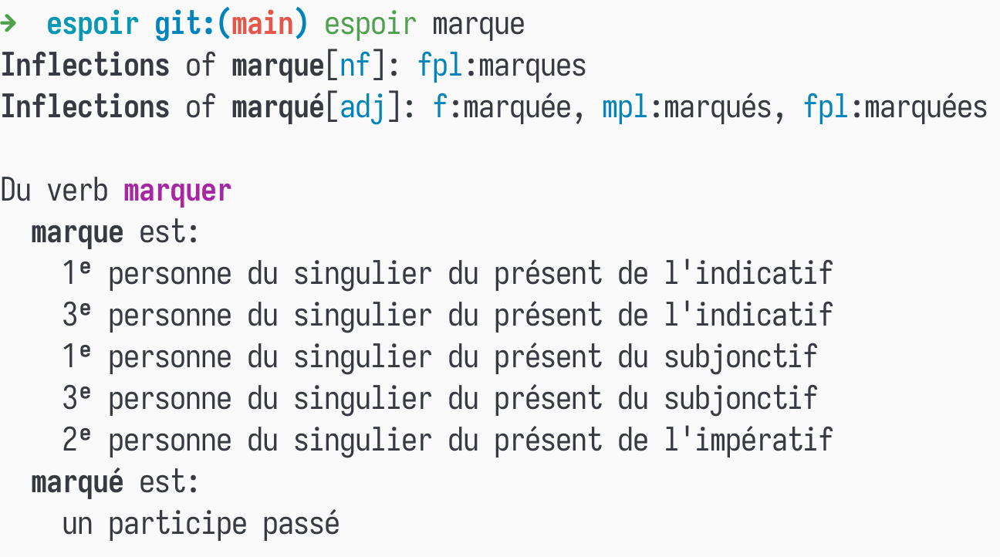

- [Espoir - A Command Line French to English Dictionary](#orgcf71fce)
  - [Installing](#orgd70b872)
  - [Usage](#org411c458)
  - [Screenshots](#org18b1490)
    - [Inflections Section](#orgd104a49)
    - [Concise Format](#org1f6fa23)


<a id="orgcf71fce"></a>

# Espoir - A Command Line French to English Dictionary

> espoir means "hope" in French.  

  


<a id="orgd70b872"></a>

## Installing

1.  Install [babashka](https://github.com/babashka/babashka)
2.  Save [espoir](https://raw.githubusercontent.com/imakira/espoir/main/espoir) somewhere and run it!  
    
    ```bash
    curl https://raw.githubusercontent.com/imakira/espoir/main/espoir > espoir
    chmod +x espoir
    ./espoir espoir
    ```


<a id="org411c458"></a>

## Usage

Usage: espoir [options] words  
Options:  
  [option]              [default]  [descriptions]  
  -s, &#x2013;short           false      Show results in a more concise format, omitting some information.  
  -a, &#x2013;all             false      Show all translation sections (only principal translations are shown by default)  
  -N, &#x2013;no-inflections  false      Don't show inflection sections  
  -h, &#x2013;help  


<a id="org18b1490"></a>

## Screenshots


<a id="orgd104a49"></a>

### Inflections Section

  


<a id="org1f6fa23"></a>

### Concise Format


