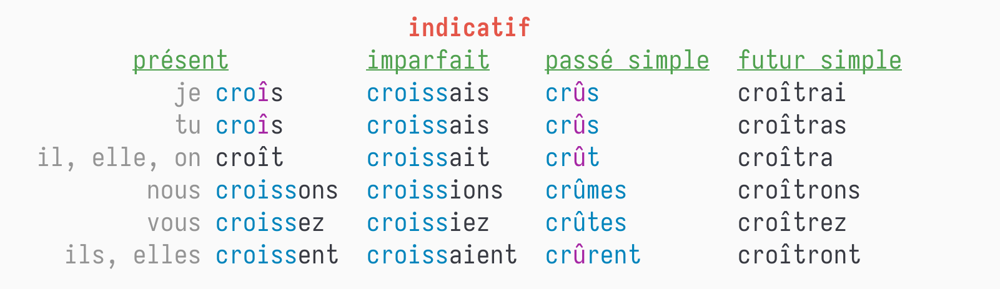

# Espoir - A Command Line French to English Dictionary

> espoir means "hope" in French.  

  


## Installing


### Using npm

```bash
npm -g @imakira/espoir
espoir espoir
```


### Using Nix

```bash
nix run github:imakira/espoir -- espoir
```


## Usage

```bash
Usage: espoir [options] words
Options: 
  -h, --help              [default]  Show help messages
  -g, --conjugation       false      Get conjugations of a verb
  -s, --short             false      Show results in a more concise format, omitting some information.
  -a, --all               false      Show all translation sections (only principal translations are shown by default)
  -N, --no-inflections    false      Don't show inflection sections
  -f, --fr-to-en          false      Force French to English lookup
  -e, --en-to-fr          false      Force English to French lookup
  -I, --inflections-only  false      Only show inflection sections
  -n, --no-color          false      Disable ascii color output, env NO_COLOR is also supported
```


## TODO 

-   [DONE] English to French Support
-   [DONE] Conjugations of a Verb
-   [DONE] builtin caching
-   [TODO] alternative backend with data from wiktionary (and offline usage)?


## Screenshots


### Inflections Section

  


### Concise Format

  


### English to French

  


### Conjugations

```bash
espoir -g croître # part of the result
```

  


## Contribution

If you encountered any issue, feel free to fire an issue at <https://github.com/imakira/espoir/issues>.  

If you find this little tool useful, I will really appreciate if you can give the project a star.  

If you want to experiment with the code, check the [develop.org](https://github.com/imakira/espoir/blob/main/develop.org)
